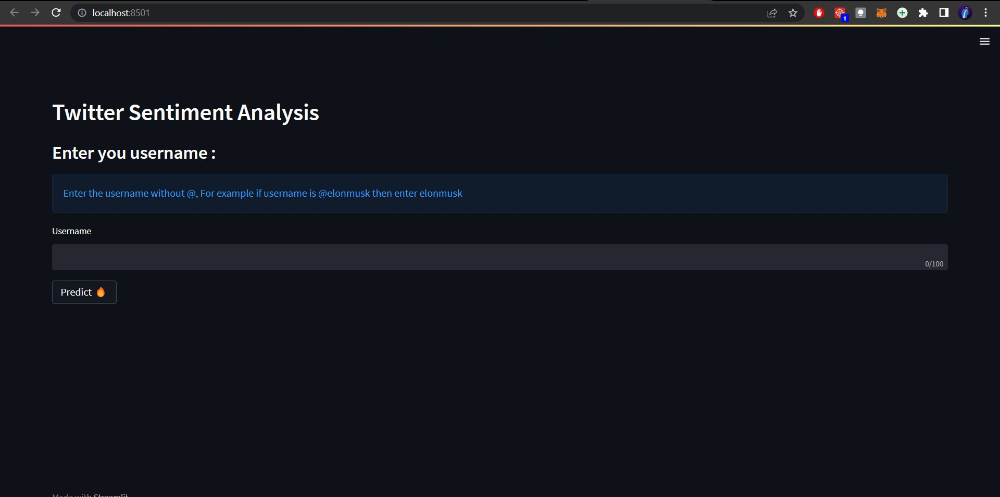
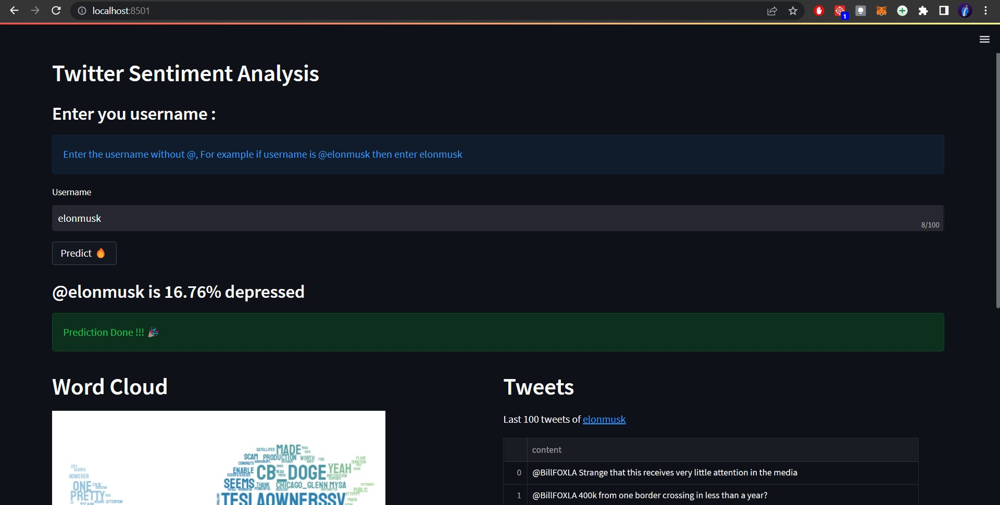
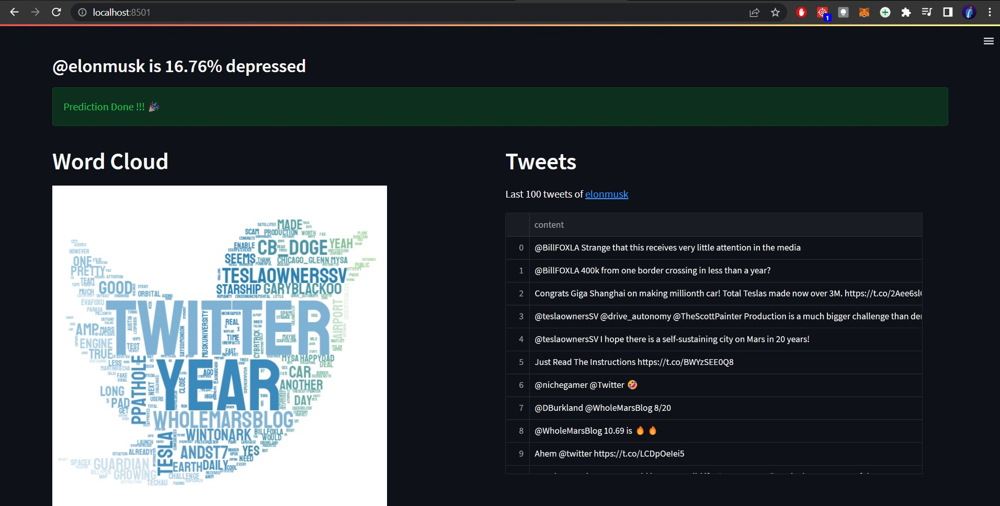
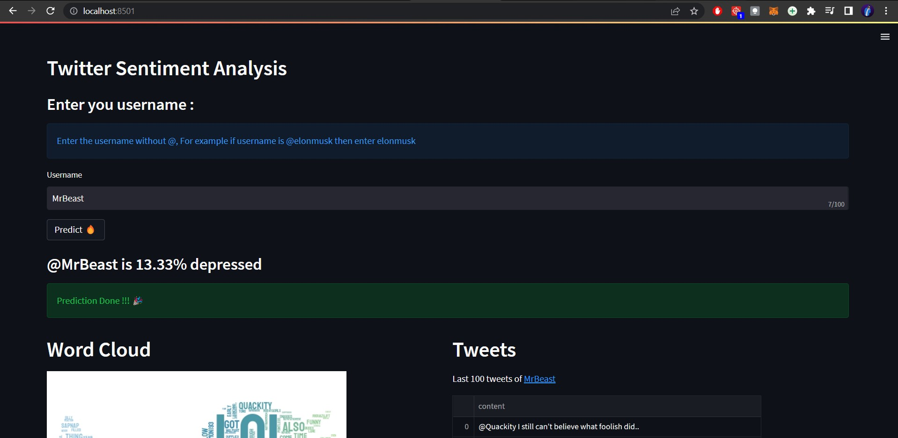
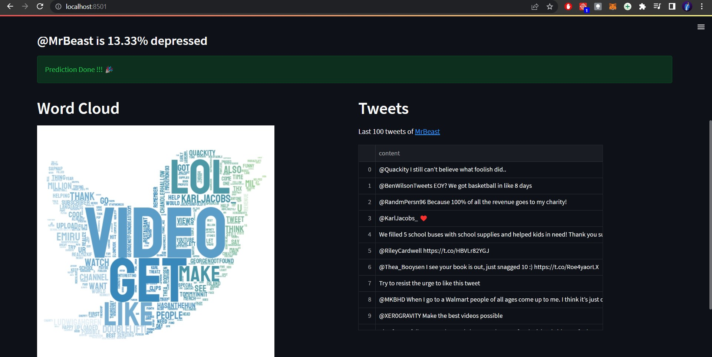

# Depression Analysis using tweets

This app extracts last 100 tweets of the user by their username, it than predict the user Depression, it also creates a word cloud of their tweets.


## Installation 

Go to the Depression Analysis using tweets folder and run 

```
pip install -r requirements.txt
```
[python version 3.8 Recommended]

you must download the trained_model.h5 file from the google drive [link](https://drive.google.com/file/d/15AH8GdrOXOWNtaHxUR9ojskWbWebQA3o/view?usp=sharing) to run the project successfully.
## Run Locally 
Go to the Depression Analysis using tweets folder and run 

```
streamlit run app.py
```

## Screenshots
UI 


some predictions 






## Author

- [@harshit-wadhwani](https://github.com/harshit-wadhwani)


## 🔗 Links
[](https://www.linkedin.com/in/harshitwadhwani/)
[](https://twitter.com/akadaemonium_)


## Feedback

If you have any feedback, please reach out to us at harshit4work@gmail.com
